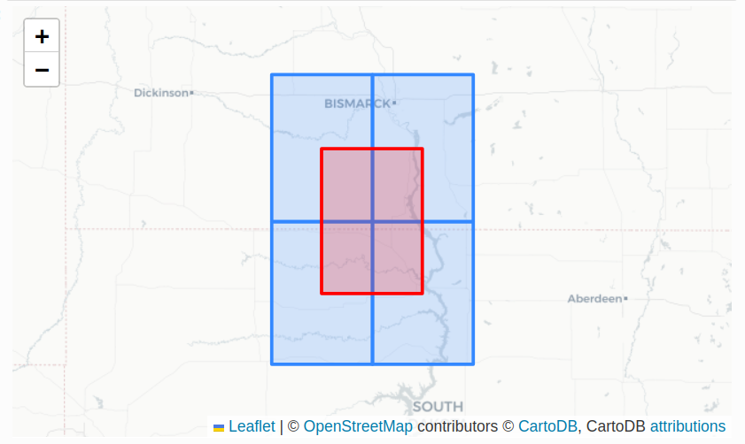

# Downloading Satellite Data from SpatioTemporal Asset Catalogs (STAC)

Authors: 

* Michele Tobias, PhD - [University of California Davis DataLab](https://datalab.ucdavis.edu/)
* Alex Mandel, PhD - [Development Seed](https://developmentseed.org/)

last update: 2023-12-05

## Introduction

What are we generally trying to learn?

How to search online data catalogs for spatial data and access the data efficiently with software. In this case R code you write yourself.

Why does it matter? Why do it this way vs. downloading images and storing them yourself?

- Using a catalog lets you: 
    - update or modify your query
    - filter based on metadata
    - adds reproducability. (See also [FAIR](https://www.go-fair.org/fair-principles/))
- Reduce the amount of data you need to download, manage, and store.
- (Optional) move your computation closer to the data. (e.g if the data is on AWS you could run your compute on AWS)

## SpatioTemporal Asset Catalogs (STAC)

### What is it?

A standard way of describing geospatial data in a computer oriented, but still human readable format (JSON). It was originally created to catalog large amounts of Satellite based Earth Observation data.

### Why is it useful?
We use STAC to organize a large number of files and make it possible to search for which files are needed for a given analysis and then pass the results to the analysis tools. The key is that STAC describes what to expect inside a file and where to find the file in a way that can be passed to computer code or programs that need to access the data.

Define: 

* Asset - a single file
* Item - one or more Assets that contain data about the same place in time (e.g. multiple bands from the same capture) - aka Scenes. 
* Collection - one or more Items that have shared characteristics (e.g. same Sensor, processing level, or product)
* Catalog - one or more Collections (e.g. Landsat7 and Landsat8 collections are both in the USGS catalog)
* STAC API - a web url for searching a STAC Catalog using computer software or code.  (API = Application Programming Interface)

https://stacspec.org/en/tutorials/intro-to-stac/

### Cloud Optimized GeoTIFF (COG)

What is a GeoTIFF? Why do you want to work with this?

Based on the Image filetype TIFF, a GeoTiff adds spatial reference metadata to the image allowing you to store regularly gridded data, aka raster data. This lets you load data in geospatial software and know where in the world the data is and how much ground each pixel represents. 

What does "Cloud Optimized" mean? Why is this helpful?

The data inside the file is organized to allow easier and faster access to portions, or chunks, of data. This allows you to only read the part of data you need instead of the whole file.

Example from: [NASA MAAP](https://docs.maap-project.org/en/latest/technical_tutorials/access/accessing_cod.html)

This is helpful: [Cloud-Optimized Geospatial Formats Guide](https://guide.cloudnativegeo.org/) - probably because one of the authors looks very familiar!

### More detail about APIs in general and STAC API specifically

An Application Programming Interface (API) is a set of commands that a service knows how to respond to. You can think of it just like Library of Functions in programming. Each Function takes some set of required and optional arguments and then returns results. In the case of a web API, there's a unique url to each function, and a portion of the url that contains the arguments (aka parameters).

Some examples - you can open these in a web browser the response will be a GeoJSON.

List collections in the Catalog

https://planetarycomputer.microsoft.com/api/stac/v1/collections

List items in the specified Collection

https://planetarycomputer.microsoft.com/api/stac/v1/collections/3dep-lidar-dsm/items

Search

https://planetarycomputer.microsoft.com/api/stac/v1/search?collections=3dep-lidar-dsm&bbox=-124.41060660766607,32.5342307609976,-114.13445790587905,42.00965914828148&limit=25

**Resources**

- A list of some publicly accessible STAC Catalogs with APIs https://stacindex.org/catalogs?type=api
- A list of software and programming libraries for using STAC https://stacindex.org/ecosystem?category=Client
- An example of STAC API documentation that documents how to use the API. https://planetarycomputer.microsoft.com/api/stac/v1/docs

## A Typical Workflow:

1. First time only: Configure your environment & do your set up for authentication - ( i.e. sign up for an account with the Data Provider )

1. Authenticate (log in to your account using R or Python code)

1. Search the STAC catalog (using the API) to see what's available

1. Decide which images you want

1. Retrieve the data you want to work with

1. Run your analysis

## Links to example code

# Reference Material & Further Reading

[Cloud-based processing of satellite image collections in R using STAC, COGs, and on-demand data cubes](https://r-spatial.org/r/2021/04/23/cloud-based-cubes.html)

[Cloud-Optimized Geospatial Formats Guide](https://guide.cloudnativegeo.org/)
